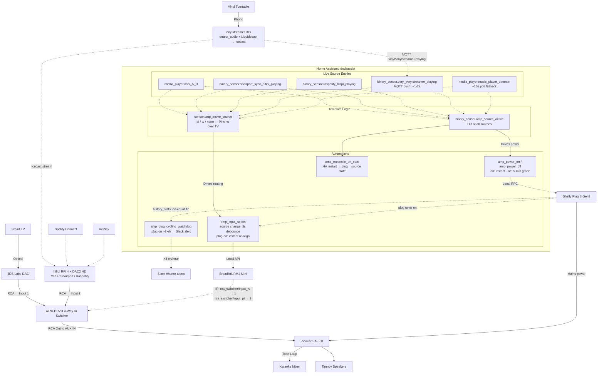

# Living Room Audio Automation

Home Assistant powers and routes a vintage Pioneer SA-508 amplifier based on which
audio/video source is active. The amp has no remote control of any kind: power is
switched at the mains by a Shelly plug, and its single input is fed by a 4-way RCA
switcher driven over IR by a Broadlink blaster.

Everything below `Home Assistant` in the diagram is config-managed in this repo
(`ansible/roles/services/homeassistant/`); deploy with
`ansible-playbook ansible/playbooks/services.yml --limit dockassist --tags config`.

## Architecture

## Behavior

- **Power on** is instant: any source going active (AirPlay/Spotify/vinyl playing,
  or the TV powering on) switches the plug on. Debounce against phantom vinyl
  starts lives in `detect_audio` on vinylstreamer, not in HA.
- **Power off** waits a 5-minute idle grace so track gaps and short pauses don't
  cut the amp.
- **Input selection**: `sensor.amp_active_source` picks `pi`/`tv` (active Pi
  playback beats a merely-on TV). On change, the RM4 fires the matching learned
  IR code at the switcher (3s debounce); when the plug turns on, the input is
  re-aligned instantly. Learned codes are checked into the role and seeded to
  `.storage` only-if-missing (see ARCHITECTURE_DECISIONS).
- **Resilience**: an HA restart reconciles the plug against source state; a
  watchdog pages `#home-alerts` if the plug starts cycling (>3 on-events/hour).

Verified end-to-end with the amp under power 2026-07-18: instant on (~12W idle
draw), three 5-min-grace auto-offs, and IR input switching on real source changes.
