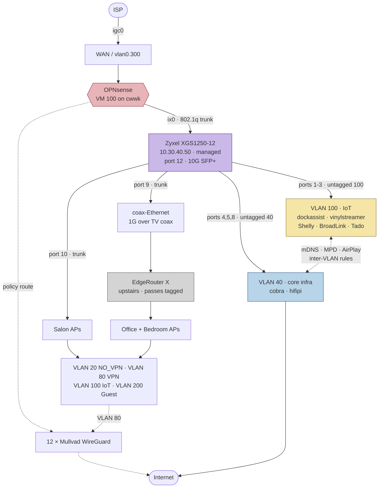

# Network Architecture

The layer that isn't in this repo.

Every other part of this infrastructure is reconstructible from Ansible: hosts,
roles, services, monitoring. The network is not. It lives entirely in
OPNsense's `/conf/config.xml` and the UniFi controller's database, and until this
document existed it was written down nowhere — six VLANs, thirteen WireGuard
tunnels and a policy-routed DNS exit that no file in this repository mentioned.

That is also why `docs/BACKUP_AND_RECOVERY.md` rates the OPNsense config as the
highest-risk artefact in the estate: losing it means rebuilding all of the below
by hand, from memory.

> **Sanitised on purpose.** This repository is public. WAN addressing, Mullvad
> endpoint IPs and every WireGuard public key are deliberately omitted. Only
> RFC1918 internals and design intent appear here. Do not paste raw
> `configctl wireguard showconf` or `config.xml` output into this file.

**Everything below was read from the live firewall and the live UniFi
controller**, not inferred, unless a line says otherwise — and where an earlier
inference turned out to be wrong, the correction is left in rather than edited
out. Probe commands are listed under
[Re-deriving this document](#re-deriving-this-document) and
[Reading the UniFi controller](#reading-the-unifi-controller), so this can be
checked rather than trusted.

---

## Segmentation

Six VLANs trunked over a single SFP+ link (`ix0`), plus WAN on a separate copper
NIC (`igc0`). The firewall is the gateway for every segment and holds `.254` in
each.

| VLAN | Subnet | OPNsense descr | Purpose | Egress |
|-----:|--------|----------------|---------|--------|
| 20 | `10.30.20.0/24` | `VLAN20_NO_VPN` | Hosts that must **not** be tunnelled — anything geo-locked or VPN-hostile | WAN direct |
| 40 | `10.30.40.0/24` | `VLAN40_Native` | Core infrastructure services; **native VLAN for cabled hosts** | WAN direct |
| 80 | `10.30.80.0/24` | `VLAN80_VPN` | WiFi clients that egress via VPN | Mullvad |
| 100 | `10.30.100.0/24` | `VLAN100_IoT` | IoT / home automation | — |
| 200 | `10.30.200.0/24` | `VLAN200_Guest` | Guest network | — |
| 300 | *(WAN)* | `ETH2_WAN` | Uplink, DHCP from ISP, on `igc0` | — |

VLAN 40 being the **native** VLAN is the detail that matters most for anything in
this repo: every Ansible-managed host, the Proxmox guests at `10.30.40.200–204`
and the test containers at `.205`/`.206` sit here, untagged.

An interface group **`Trusted_VLANs`** exists and is what most inter-VLAN rules
are written against, rather than listing segments individually.



Two things to carry from this diagram:

- **The Zyxel is the single point through which all wired traffic passes.** It is
  as load-bearing as OPNsense and, unlike OPNsense, its config is not backed up
  anywhere — see [finding 12](#12-the-switch-configuration-is-not-backed-up).
- **The Ansible-managed fleet spans VLAN 40 and VLAN 100.** The audio system and
  hostname resolution both depend on traffic crossing that boundary. See
  [Where the fleet actually lives](#where-the-fleet-actually-lives).

There are **three VLAN-aware devices** in series on the upstairs path — OPNsense,
the Zyxel, and the EdgeRouter X. Only the first two are documented here.

---

## The circular dependency worth knowing

OPNsense runs as **VM 100 on `cwwk`**, the Proxmox host — which sits on VLAN 40,
whose gateway is OPNsense. If `cwwk` goes down there is no internet and no
routing at all, and recovering it needs local console access, not the network.

This is already flagged in memory as *"cwwk = internet SPOF"* and has bitten
twice via fan-loss overheating (2026-06-30, 2026-07-31). It is a network fact as
much as a hardware one, which is why it is repeated here.

---

## VPN

### Outbound — Mullvad (12 tunnels)

Twelve Mullvad WireGuard tunnels, three per exit region, all sharing one client
address on the Mullvad side. Each has a matching outbound-NAT rule
(`NAT for WG_MULLVAD_GW_<REGION><n>`), so they are selectable exits rather than a
single always-on tunnel.

| Interface | OPNsense descr | Region | State |
|-----------|----------------|--------|-------|
| `wg0` | `wg0_mullvad_nl1` | NL | up |
| `wg2` | `wg0_mullvad_nl2` | NL | up |
| `wg3` | `wg0_mullvad_nl3` | NL | up |
| `wg4` | `wg0_mullvad_es1` | ES | up |
| `wg5` | `wg0_mullvad_es2` | ES | up |
| `wg6` | `wg0_mullvad_es3` | ES | up |
| `wg7` | `wg0_mullvad_us1` | US | up |
| `wg8` | `wg0_mullvad_us2` | US | up |
| `wg9` | `wg0_mullvad_us3` | US | ⚠️ **dead — see below** |
| `wg10` | `wg0_mullvad_uk1` | UK | up |
| `wg11` | `wg0_mullvad_uk2` | UK | up |
| `wg12` | `wg0_mullvad_uk3` | UK | up |

`wg0` carries by far the most traffic (multiple GiB), consistent with NL1 being
the default exit; the rest sit at tens of MiB, which is roughly keepalive-only.

The interface descriptions are all prefixed `wg0_` regardless of which interface
they are on — a copy-paste artefact from however they were created. Harmless, but
it makes them impossible to tell apart at a glance in the UI.

### Inbound — `wg1_server` (road warrior)

`wg1` is the only tunnel that terminates *on* the firewall rather than leaving
it: a road-warrior server on `10.30.41.0/24`, firewall at `10.30.41.1`.

| Peer address | State |
|--------------|-------|
| `10.30.41.5` | active — handshaking, ~1 GiB in / 3.2 GiB sent |
| `10.30.41.7` | configured, never connected (0 B received) |
| `10.30.41.8` | configured, never connected (0 B received) |

All three use preshared keys in addition to the peer key. Two of the three have
never completed a handshake — most likely provisioned-and-unused device slots
rather than a fault, but they are indistinguishable from a broken client until
someone confirms which device each is meant to be.

---

## DNS

Unbound on OPNsense is the resolver for the whole estate, since Pi-hole was
retired in **November 2025** (`pihole-lxc`, CT 102, still present commented-out in
`ansible/inventory/hosts.yml` with `archived_reason`).

Relevant rules, by description:

- `All hosts to Pihole DNS`
- `Allow Pihole DNS failover to public servers`
- `Allow DNS queries to Unbound`
- `TEST - Block VPN resolver`

Three of those four still name Pi-hole nine months after it was decommissioned,
and one is explicitly labelled `TEST`. The rules are almost certainly doing
something useful — but what they are *called* no longer describes the estate,
which is exactly the trap this document exists to prevent.

### Unbound is fully recursive

Verified on the live box: `/var/unbound/` contains **no `forward-zone` and no
`forward-addr` anywhere**. `etc/dot.conf` and `etc/domainoverrides.conf` are both
empty, and `unbound.conf` loads `root-hints`. Unbound resolves from the root
servers itself; it does not forward to anything.

This matters because `scripts/services/opnsense/monitor_dns_failover.sh` opens by
describing a different architecture:

```
#   Layer 1: Unbound forwards to 4 Mullvad DNS servers (10.64.0.1, .3, .7, .11)
#            Each routes through different tunnel - automatic failover
#   Layer 2: This script - if ALL tunnels down, switch to Cloudflare
```

Layer 1 is not what is running. See
[the failover script's premise](#3-the-dns-failover-scripts-premise-no-longer-holds).

### Port 53 redirect

OPNsense transparently redirects outbound port 53 to Unbound, so clients cannot
bypass it by hardcoding a public resolver. `tests/cases/health_no_internet.sh`
depends on this behaviour.

Note the redirect catches **DNS only**. It does not affect ICMP or other traffic
to the same address, which is what made the Quad9 finding below need care.

---

## ⚠️ Confirmed drift and defects

Found while deriving this document, on **2026-08-07**. None of these were known
before; none are fixed. Each was verified on the live firewall, not inferred.

### 1. `wg9` (Mullvad US3) is dead, and Quad9 is routed through it

`wg9` has a peer configured and is sending — **15.42 MiB out, 0 B in, no
handshake ever recorded**. The tunnel has never come up.

A static route pins `9.9.9.9` to `wg9`:

```
9.9.9.9   10.64.0.9   UGHS   wg9
```

So Quad9 is unreachable from the firewall, confirmed by ping:

```
9.9.9.9 → 2 packets transmitted, 0 received, 100.0% packet loss
1.1.1.1 → 2 packets transmitted, 2 received, 0.0% packet loss
```

**The blast radius is narrow — and an earlier draft of this document got it
wrong.** The static route applies only to traffic *originating on the firewall*.
Forwarded LAN traffic follows per-rule policy routing instead, which overrides the
routing table in pf. Verified from `cwwk`:

```
ping 9.9.9.9   → 2 transmitted, 2 received, 0% loss
getent hosts deb.debian.org (via 9.9.9.9) → resolves
```

So LAN clients reach Quad9 normally. Only the firewall itself cannot.

Nothing currently depends on that: Unbound is
[fully recursive](#unbound-is-fully-recursive) and never queries Quad9, and both
DNS monitoring scripts deliberately use `1.1.1.1` as their fallback, commented
*"no VPN route, uses default gateway"* — the author knew to avoid the
VPN-routed resolver.

What remains is genuine but lower-severity: **a dead tunnel and a static route
pointing into it**, plus a stale Unbound override naming the retired Pi-hole:

```
local-data: "pihole.local  IN A 9.9.9.9"
local-data-ptr: "9.9.9.9 pihole.local"
```

No host in the repo or the fleet references `pihole.local` — grepped the repo and
checked `/etc/resolv.conf` across five hosts. It is dead config, not a live trap.

*Still not verified:* whether `wg9` belongs to a gateway group where its deadness
would degrade failover for other traffic. That needs `config.xml`, which
`read_agent` cannot read.

### 2. `cwwk` bypasses the estate resolver

The hypervisor's `/etc/resolv.conf` is `nameserver 9.9.9.9` — every other host
checked (`cobra`, `hifipi`, `dockassist`, `unifi`) points at `10.30.40.254`.

DNS works there today (Quad9 is reachable from the LAN, per above), so this is
not an outage. But it means the single most critical host in the estate — the one
whose failure takes the internet down with it — resolves names via a third party
instead of the resolver the rest of the fleet uses, and gets none of Unbound's
local overrides. It also looks like an oversight rather than a decision: `9.9.9.9`
is the default upstream baked into the **archived** Pi-hole role
(`ansible/roles/services/pihole/`), which is where the address entered this estate.

### 3. The DNS failover script's premise no longer holds

`scripts/services/opnsense/monitor_dns_failover.sh` is running and healthy — its
state file reads `healthy|0|9359|vpn`, i.e. **9359 consecutive successful checks**
in `vpn` mode. Its health probe is sound: it independently queries the four
Mullvad resolvers with `drill` and they answer.

But its *premise* and its *remediation* both target a configuration that is not
in use. The script exists to switch Unbound's forwarder to Cloudflare when all
tunnels drop — and Unbound has no forwarder to switch, because it resolves
recursively from root hints.

**Why this is the dangerous kind of stale:** the script reports healthy and will
keep reporting healthy. Nothing about its output reveals that its Layer 2
protection is aimed at a setting that isn't there. It is green because its
probe passes, not because the protection works.

The good news is that the protection is also no longer *needed* in its original
form — recursive Unbound does not depend on the Mullvad tunnels for resolution,
so tunnels dropping should not break DNS at all. That makes this a cleanup, not
an outage risk.

*Not verified:* what the script actually does to `config.xml` if it ever fires,
and whether that would newly *introduce* forwarding. Testing it means taking all
twelve tunnels down, which is not something to do casually. **Read the script's
`switch_to_fallback` path before trusting either outcome.**

### 4. Two `wg1` peers have never connected

`10.30.41.7` and `10.30.41.8` — see above. Needs a decision: identify or remove.
Unused peer slots are standing inbound credentials.

### 5. ~~One Ubiquiti device is a firmware generation behind~~ — RETRACTED

Withdrawn once the controller was readable. `10.30.40.3` is a **different model**
(U7 Lite) on its own firmware line, running `6.8.2` — *newer* than the other
three at `6.7.54`. The older dropbear banner reflects the model's own release
train, not a missed update. See the correction note under
[Access points](#access-points).

### 6. Fleet name resolution has no fallback

Covered in [Name resolution runs on mDNS, not DNS](#name-resolution-runs-on-mdns-not-dns).
Unbound serves the estate's recursive DNS but holds no records for the estate's
own hosts, so Ansible reachability rests entirely on mDNS crossing VLAN 40↔100.
Adding host overrides in Unbound for the seven fleet hosts would cost minutes and
remove the dependency — **not done, proposed only.**

### 7. Pi-hole-era naming outlived Pi-hole by nine months

Three firewall rules and one Unbound override still refer to a host retired in
November 2025, and one rule is labelled `TEST`. Nothing is known to be broken by
this; the risk is that the next person to read those rules — human or agent —
believes them.

---

### 8. Two SSIDs share the guest VLAN with different isolation

`candela.gorostiza` has **L2 isolation on**. `estonoesmazagon_guest` is on the
**same VLAN 200** with **L2 isolation off**.

Because they share a broadcast domain, the isolation on the first is only as
strong as the second: a client associated to `estonoesmazagon_guest` is not
prevented from reaching clients on `candela.gorostiza`. Whatever the isolation
was meant to protect, an unisolated SSID sits beside it on the same segment.

⚠️ **Reasoned from the configuration, not tested.** Confirming it means
associating a device to each SSID and attempting traffic between them. Worth
doing before deciding whether this matters — the intent behind two guest SSIDs
isn't recorded anywhere, and one of them is named after a person, which suggests
it was set up deliberately for someone.

### 9. The IoT SSID has protected management frames disabled

`estonoesmazagon_iot` is the only SSID with `pmf_mode=disabled`; the other four
are `optional`. Without 802.11w, management frames are unauthenticated and
clients can be deauthenticated by anyone in range — the classic precondition for
forced-reassociation and handshake-capture attacks.

The IoT VLAN is where the Shelly devices, the BroadLink IR blasters and the Tado
bridge live, so this is the segment controlling **heating and mains power**.

⚠️ **`disabled` is very likely deliberate** — cheap ESP32-class devices often
cannot associate with PMF enabled, which is exactly why this SSID would differ
from the rest. Treat it as a documented trade-off to re-confirm, not a
misconfiguration to go fix. Raising it to `optional` would be the test; if the
Shelly devices drop off, the answer is no.

### 10. Switch port 1 is running at 10 Mbps half-duplex

Every other live port on the Zyxel is `1G-Full`. **Port 1 is `10M-Half`** — two
orders of magnitude down, and half-duplex, which means collisions and
retransmits. It is not idle: 600 K packets out, 203 K in.

Port 1 is `PVID 100`, so whatever is on it is an **IoT-VLAN device**.

Three plausible causes, in order of likelihood: a damaged or non-8-conductor
cable (a break in the pairs used for gigabit will fall back exactly like this), a
failing port or NIC, or a genuinely 10 Mbps device. **Swapping the cable is the
one-minute test** — if it comes up at 1G, that was it.

⚠️ *What is on port 1 is not established.* The switch UI shows link state, not
device identity, and the ports aren't labelled in anything I can read. Given
PVID 100, the candidates are `vinylstreamer` (`10.30.100.110`) or a wired IoT
device. **If it is `vinylstreamer`, this matters more than it looks** — that host
streams audio to `hifipi` via Icecast, and a half-duplex 10 Mbps link is a
plausible contributor to any streaming stutter.

### 11. Switch port 4 has a CRC error

One. Not zero. Every other port is clean, and this counter is cumulative over
163 hours of uptime, so it is a single event rather than a pattern.

Not actionable on its own — but CRC errors come from physical-layer problems, and
a cable that produces one will usually produce more. Worth re-reading the counter
in a few weeks: still `1` means noise, climbing means a cable to replace.

### 12. The switch configuration is not backed up

`docs/BACKUP_AND_RECOVERY.md` covers OPNsense, Home Assistant, Plex, Proxmox and
UniFi. It does not cover the Zyxel, whose UI has a
**Configuration Restore/Backup** function producing a config file.

That config is the entire VLAN and PVID map — the thing that decides which
physical port lands in which network. Losing it means re-deriving the port map by
hand, which is precisely the situation this document was written to prevent, and
the switch is a single unit with no redundancy.

Related, lower severity: **HTTP is enabled alongside HTTPS** on the management
interface. Management is at least confined to VLAN 40 rather than VLAN 1, which
is the more important half of that decision.

## Physical layer

Read from the UniFi controller API (`unifi-lxc`, CT 101, `10.30.40.201:8443`)
using a read-only account, and cross-checked against the firewall's ARP table.

### The backbone switch — Zyxel XGS1250-12

**Every wired host in the estate connects to this switch.** It is a *managed*
switch at `10.30.40.50`, and it does the 802.1Q work: OPNsense trunks all VLANs
to it over 10G, and it hands each host an untagged port in the right VLAN.

| | |
|---|---|
| Model / firmware | XGS1250-12 · `V2.00(ABWE.1)C0` |
| Address | `10.30.40.50/24`, gateway `10.30.40.254`, **static** (DHCP client disabled) |
| Management VLAN | **40** — not VLAN 1 |
| Uptime at capture | 163 h |
| Management | HTTPS **and HTTP** both enabled, 15-min timeout |

> Sourced from the switch's own web UI on 2026-08-07, supplied by the operator.
> `read_agent` has no access to it — see [Getting at the switch](#getting-at-the-switch).

#### Port map

`U:` = untagged/access, `T:` = tagged/trunk. Traffic counters are cumulative
since last clear, and are the strongest available hint at what is on each port.

| Port | Link | PVID | Tagged | TX / RX pkts | Role |
|-----:|------|-----:|--------|--------------|------|
| 1 | 🔴 **10M-Half** | 100 | — | 600 K / 203 K | IoT host — **degraded, see finding 10** |
| 2 | 1G-Full | 100 | — | **63 M / 74 M** | IoT host, busiest access port |
| 3 | Down | 100 | — | 0 | spare IoT |
| 4 | 1G-Full | 40 | — | 1.9 M / 3.7 M | VLAN 40 host · ⚠️ 1 CRC error |
| 5 | 1G-Full | 40 | — | 1.2 M / 446 K | VLAN 40 host |
| 6 | Down | 40 | 20, 80, 100… | 0 | spare trunk |
| 7 | Down | 40 | 20, 80, 100… | 0 | spare trunk |
| 8 | 1G-Full | 40 | — | 3.5 M / 1.6 M | VLAN 40 host |
| 9 | 1G-Full | 40 | 20, 80, 100… | 2.2 M / 1.3 M | **coax backbone → upstairs** |
| 10 | 1G-Full | 40 | 20, 80, 100… | 8.5 M / 13 M | AP trunk |
| 11 | Down | 40 | 20, 80, 100… | 0 | spare trunk |
| 12 | **10G-Full** | 1 | 20, 40, 80… | **90 M / 72 M** | 🔗 **SFP+ uplink to `cwwk` → OPNsense** |

Two things worth reading off this:

- **VLAN 40 is tagged on the uplink and untagged on the access ports.** So hosts
  are genuinely untagged — the "native VLAN" description holds from the host's
  point of view — but the trunk itself carries 40 tagged like any other VLAN.
  Port 12's PVID is `1`, an unused VLAN, so untagged frames arriving on the trunk
  go nowhere. That is the correct way round.
- **Three trunk ports sit unused** (6, 7, 11), pre-configured with the same VLAN
  set as the live ones. Spare capacity for another AP or uplink, already wired
  for it.

#### The upstairs run

Port 9 leaves the cabinet over a **coax-to-Ethernet adapter**, using the house TV
coax to carry 1G upstairs. Upstairs it lands in an **EdgeRouter X**, which exists
specifically to pass tagged traffic onward — which is why port 9 is a trunk and
not an access port. The office and main-bedroom APs hang off that EdgeRouter.

⚠️ **Operator-supplied and not yet confirmed on the hardware** — the port number
in particular. Everything else in the port map is read from the switch UI. The
EdgeRouter X itself is **not** in this document: it has not been probed, its
config is unknown, and it is a third VLAN-aware device in the path after
OPNsense and the Zyxel.

### Access points

**All four Ubiquiti devices are access points**, trunked off the Zyxel — two in
the cabinet's reach, two upstairs behind the coax run and the EdgeRouter.

| Name | Address | Model | Firmware | Uplink |
|------|---------|-------|----------|--------|
| `U6-Lite-Office` | `10.30.40.2` | U6 Lite | `6.7.54.15663` | **wired root**, 1 Gbps |
| `U6+-Salon-TV` | `10.30.40.1` | U6+ | `6.7.54.15663` | wired ← `U6-Lite-Office` port 1, 1 Gbps |
| `U6-Lite-Salon-Relay` | `10.30.40.4` | U6 Lite | `6.7.54.15663` | ⚠️ **wireless mesh** ← `U6+-Salon-TV`, RSSI 18 |
| `UAP-AC-Lite-Habitacion` | `10.30.40.3` | U7 Lite | `6.8.2.15592` | ⚠️ **wireless mesh** ← `U6-Lite-Office`, RSSI 23 |

All four adopted, all `state=1` (connected).

**Two of the four are wireless-meshed, not wired** — `Salon-Relay` (the name says
so) and `Habitacion`. Every client on those two APs has its traffic relayed over
the air before it reaches the wired network. The reported mesh RSSI values, 18
and 23, are the two lowest link metrics in the estate. *This document does not
assert a pass/fail threshold for them* — UniFi's mesh RSSI scale is not a plain
dBm figure and I could not verify how it maps. They are recorded because they are
the only wireless links carrying infrastructure traffic.

> **Corrections.** Two earlier claims in this document were wrong, both from
> inferring hardware from network-level evidence:
>
> - *"Two switches and two access points"*, inferred from open ports. All four
>   are APs. And `10.30.40.3` was flagged as a *firmware generation behind*
>   because its dropbear banner was older (`2024.86` vs `2025.89`) — it is a
>   different model (U7 Lite) on its own firmware line, running `6.8.2`, which is
>   *newer*. Version strings are not comparable across models.
> - *"The cabinet switch is an unmanaged Zyxel"* — **it is managed**, it is the
>   backbone every wired host connects to, and it carries the entire VLAN
>   configuration above. It never appeared in the firewall's ARP table (it was
>   simply not ARP-active during the sweep) and it is not adopted into UniFi, so
>   both of my discovery methods missed it completely.
>
> The lesson generalises: **ARP is not an inventory.** A device that isn't
> talking during the sweep does not exist as far as `arp -an` is concerned, and
> the most important switch in the estate is exactly the kind of device that sits
> quiet.

### Wireless — SSID → VLAN

Five SSIDs, each bound to a network in the controller. This is the mapping that
turns the segmentation table above into something a client actually lands in:

| SSID | Network | VLAN | L2 isolation | PMF (802.11w) |
|------|---------|-----:|--------------|---------------|
| `estonoesmazagon` | VPN | 80 | off | optional |
| `estonoesmazagon_novpn` | NO_VPN | 20 | off | optional |
| `estonoesmazagon_iot` | IOT | 100 | off | ⚠️ **disabled** |
| `estonoesmazagon_guest` | GUEST | 200 | ⚠️ **off** | optional |
| `candela.gorostiza` | GUEST | 200 | on | optional |

All five are WPA2-PSK. **None uses WPA3**, and none is configured as a UniFi
"guest" network (`is_guest=false` throughout) — so guest treatment comes entirely
from OPNsense's VLAN 200 rules, not from the controller's guest-control features.

The default SSID `estonoesmazagon` lands on **VLAN 80**, meaning ordinary WiFi
traffic egresses through Mullvad by default, and `_novpn` is the opt-out. That is
the inverse of the usual arrangement and worth knowing before debugging anything
that looks geo-blocked.

`candela.gorostiza` and `estonoesmazagon_guest` **share VLAN 200** — see
[finding 8](#8-two-ssids-share-the-guest-vlan-with-different-isolation).

### Compute

`cwwk` (`10.30.40.51`) and `opnsense` (`10.30.40.254`) share a vendor OUI
(*Changwang Technology* — the CWWK board) with **adjacent MAC addresses**,
confirming the OPNsense VM is running on a NIC of the same physical mini-PC that
hosts it. That is the [circular dependency](#the-circular-dependency-worth-knowing)
visible at the hardware level.

---

## Where the fleet actually lives

**This is the finding most likely to catch out anyone working in this repo.**
`CLAUDE.md` presents the seven hosts as one flat fleet. They are not — they
straddle two VLANs:

| Host | Address | VLAN | Hardware (OUI) |
|------|---------|------|----------------|
| `opnsense` | `10.30.40.254` | 40 | Changwang (CWWK board) |
| `cwwk` / `proxmox` | `10.30.40.51` | 40 | Changwang |
| `hifipi` | `10.30.40.100` | 40 | Raspberry Pi |
| `cobra` | `10.30.40.204` | 40 | Raspberry Pi |
| `unifi-lxc` | `10.30.40.201` | 40 | Proxmox virtual |
| `agent-lxc` | `10.30.40.203` | 40 | Proxmox virtual |
| **`dockassist`** | **`10.30.100.100`** | **100 — IoT** | Raspberry Pi |
| **`vinylstreamer`** | **`10.30.100.110`** | **100 — IoT** | Raspberry Pi |

Home Assistant and the vinyl streamer live on the **IoT** VLAN, not with the rest
of the infrastructure. That is a sensible placement — both talk constantly to IoT
devices — but nothing in the repo says so, and it has two consequences:

1. **The audio chain crosses a VLAN boundary.** `docs/AUDIO_AUTOMATION.md`
   describes `vinylstreamer` → `hifipi` streaming and `dockassist` orchestrating
   both. That path runs VLAN 100 → VLAN 40 and only works because of the
   explicit inter-VLAN rules named *"Allow MPD between all VLANs for audio
   streaming"*, *"AirPlay…"* and *"Spotify Connect communication"*. Those rules
   are not optional conveniences — the audio system depends on them.
2. **`from="10.30.0.0/16"` in the agent keys still covers both**, since it is a
   `/16` spanning every VLAN. Worth knowing that this is why it was scoped that
   way (`docs/AGENT_ACCESS.md` notes the laptop has no fixed IP).

### IoT devices (VLAN 100)

Thirteen devices, identified by vendor. Every one maps onto something already
documented elsewhere in this repo:

| Vendor (OUI) | Count | Almost certainly |
|--------------|------:|------------------|
| Espressif | 5 | Shelly devices — amp plug, Duo G3 bulbs, gas sensor |
| Hangzhou BroadLink | 2 | RM4 IR blasters (`docs/AUDIO_AUTOMATION.md`) |
| tado GmbH | 1 | Tado heating bridge |
| Raspberry Pi | 2 | `dockassist`, `vinylstreamer` |
| Apple | 1 | — |
| *(other)* | 2 | — |

VLAN 80 (WiFi VPN) held a single client at probe time, using a **randomised
MAC** (locally-administered bit set) — i.e. a phone or laptop with iOS/macOS
private WiFi addressing on.

---

## Name resolution runs on mDNS, not DNS

Unbound has **no A records and no PTR records for any fleet host**. Verified:

```
dig +short cobra @10.30.40.254   → (empty)
host 10.30.40.204                → NXDOMAIN
```

Yet `ssh cobra` works, because macOS resolves it over **mDNS/Bonjour**:

```
dscacheutil -q host -a name cobra.local → 10.30.40.204
```

This makes the firewall rule *"Allow mDNS/Bonjour between all VLANs"*
**load-bearing for Ansible itself**, not just for AirPlay discovery. The
inventory addresses hosts by name; the `-agent` SSH alias resolves them through a
`ProxyCommand` running `nc <hostname> <port>` on the Mac. If mDNS stops crossing
VLANs, every playbook targeting `dockassist` or `vinylstreamer` — the two hosts
on the far side of that boundary — fails to resolve.

Two hosts are already pinned to literal addresses rather than names:
`agent-lxc` (`10.30.40.203`, with a comment explaining the static assignment) and
the test containers (`.205`/`.206`). Those are immune. The rest are not.

---

## Reading the UniFi controller

Two paths were tried. **The database is not reachable; the API is.**

Closed — do not retry:

- `read_agent` on `unifi` has **no MongoDB client**. `/usr/lib/unifi/bin/mongod`
  is a symlink to the *server* binary, and no `mongo`/`mongosh` exists on the box.
- The controller's `mongod` binds `127.0.0.1:27117`, so it is unreachable from
  off-host anyway.

Works — a **read-only controller account** against the standalone controller's
REST API. Log in once to get a session cookie, then GET:

```bash
curl -sk -c /tmp/unifi.cookies -X POST "https://10.30.40.201:8443/api/login" \
     -H "Content-Type: application/json" \
     -d "{\"username\":\"read_agent\",\"password\":\"$UNIFI_PASS\"}"

BASE="https://10.30.40.201:8443/api/s/default"
curl -sk -b /tmp/unifi.cookies "$BASE/stat/device"       # APs: model, firmware, uplink
curl -sk -b /tmp/unifi.cookies "$BASE/rest/networkconf"  # networks → VLAN → subnet
curl -sk -b /tmp/unifi.cookies "$BASE/rest/wlanconf"     # SSIDs → network, security
curl -sk -b /tmp/unifi.cookies "$BASE/stat/sta"          # associated clients
```

The account's View Only role is enforced server-side: the session cookie carries
those permissions, so `POST`s that would change configuration are rejected by the
controller rather than by convention.

🔑 **The password is not in this repo and must not be.** It currently exists only
outside version control. **It should be moved into `vault.yml` as
`vault_unifi_readonly_password` and rotated**, since it was transmitted in
plaintext when it was set up. Until then, pass it via environment variable as
above — never inline in a script, a cron entry or a committed file.

---

## Getting at the switch

The Zyxel is **not reachable by any automated path today**. It is not in UniFi,
it has no SSH, and `read_agent` has no credentials for it. Everything in
[the port map](#port-map) came from screenshots of its web UI.

That is the largest remaining hole in this document, because the switch decides
which physical port lands in which VLAN — and because its config is the one piece
of estate-critical state with no backup at all.

Three options, cheapest first:

1. **Periodic manual export.** Its UI has *Configuration Restore/Backup*; save
   the file into the repo's backup flow. Solves [finding 12](#12-the-switch-configuration-is-not-backed-up)
   with no new access, and is worth doing regardless of the other two.
2. **Read-only web credentials in the vault.** The XGS1250-12 is a web-managed
   consumer switch — it has an admin password, not a role system, so a
   "read-only" account may not exist. **Unverified**: the Management page shows
   only *Change Password*, with no user list, which suggests a single account.
   If so, any stored credential is an admin credential, and that changes the
   risk calculation — it should not go in the vault without deciding that
   deliberately.
3. **Poll SNMP, if supported.** Would give port state, link speed and counters —
   enough to alert on [finding 10](#10-switch-port-1-is-running-at-10-mbps-half-duplex)
   automatically, and read-only by nature. **Unverified whether this model
   supports it**; the visible tabs are System / Port / VLAN / Link Aggregation /
   Mirroring / QoS / IGMP Snooping / Management, with no SNMP tab among them,
   which is not encouraging.

**Recommendation: do 1 now, and treat 3 as the thing worth checking** — a switch
port silently dropping to 10M-Half is exactly the class of fault nothing in this
estate currently watches for, and it is the same "nothing tells you a host needs
attention" gap already raised in the handover.

⚠️ **The EdgeRouter X is entirely undocumented.** It is a third VLAN-aware device,
upstairs, passing tagged traffic to two APs. Nothing here has probed it.

---

## Re-deriving this document

The network is not Ansible-managed, so this file **will** drift. It is checkable:

```bash
# Interfaces, VLANs and their addressing
ssh opnsense-agent "ifconfig -l; ifconfig | grep -E '^[a-z0-9_.]+:|vlan:|inet '"

# Routing table and default gateway
ssh opnsense-agent "netstat -rn -f inet"

# Tunnel health — one line per tunnel, UP or DEAD
ssh opnsense-agent "sudo configctl wireguard showconf | awk '/^interface:/{i=\$2} \
  /latest handshake:/{h[i]=\"UP\"} /transfer:/{t[i]=\$0} \
  END{for(k in t) printf \"%-6s %-4s %s\n\", k, (h[k]?h[k]:\"DEAD\"), t[k]}' | sort"

# Firewall rule count
ssh opnsense-agent "sudo pfctl -s rules | wc -l"   # 131 as of 2026-08-07
```

Interface descriptions, NAT rules and rule names come from `/conf/config.xml`,
which `read_agent` **cannot** read — it is root-only and not in the sudo
allowlist. That part needs an interactive session:

```bash
ssh opnsense "sudo grep -E '<descr>|<if>|<ipaddr>' /conf/config.xml"
```

**Do not generate repeated failed authentication against the firewall.** That is
what fed CrowdSec into banning `agent-lxc` on 2026-08-03.

---

## Sources

| Section | Derived from | Verified |
|---------|--------------|----------|
| VLAN subnets, interfaces | `ifconfig`, live | 2026-08-07 |
| VLAN purposes | Operator (Ignacio), plus `<descr>` in `config.xml` | 2026-08-07 |
| Tunnel inventory + health | `configctl wireguard showconf`, live | 2026-08-07 |
| Routing, Quad9 blackhole | `netstat -rn`, `ping`, live | 2026-08-07 |
| DNS overrides | `/var/unbound/host_entries.conf`, live | 2026-08-07 |
| Rule names | `config.xml` via operator session | 2026-08-07 |
| Device inventory, VLAN placement | `arp -an` on opnsense, live | 2026-08-07 |
| Vendor identification | OUI lookup against local `nmap-mac-prefixes` | 2026-08-07 |
| APs: model, firmware, mesh uplinks | UniFi controller API, live | 2026-08-07 |
| SSID→VLAN, WLAN security settings | UniFi controller API, live | 2026-08-07 |
| mDNS dependency | `dig` vs `dscacheutil`, live | 2026-08-07 |
| Guest-SSID isolation gap (finding 8) | **reasoned from config, not tested** | — |
| Switch model, VLAN/PVID map, port state | Zyxel web UI, operator screenshots | 2026-08-07 |
| Which device is on which switch port | **not established** — counters only hint | — |
| Coax run, EdgeRouter X, port 9 | **operator recollection, unconfirmed** | — |
| EdgeRouter X configuration | **never probed** | — |

MAC addresses are deliberately not listed; vendor OUIs and roles are enough to
work with and do not fingerprint individual devices in a public repository.
