# Network Architecture

The layer that isn't in this repo.

Every other part of this infrastructure is reconstructible from Ansible: hosts,
roles, services, monitoring. The network is not. It lives entirely in
OPNsense's `/conf/config.xml` and the UniFi controller's database, and until this
document existed it was written down nowhere — six VLANs, thirteen WireGuard
tunnels and a policy-routed DNS exit that no file in this repository mentioned.

That is also why `docs/BACKUP_AND_RECOVERY.md` rates the OPNsense config as the
highest-risk artefact in the estate: losing it means rebuilding all of the below
by hand, from memory.

> **Sanitised on purpose.** This repository is public. WAN addressing, Mullvad
> endpoint IPs and every WireGuard public key are deliberately omitted. Only
> RFC1918 internals and design intent appear here. Do not paste raw
> `configctl wireguard showconf` or `config.xml` output into this file.

**Everything below was read from the live firewall**, not inferred, unless a line
says otherwise. Probe commands are listed under [Re-deriving this document](#re-deriving-this-document)
so it can be checked rather than trusted.

---

## Segmentation

Six VLANs trunked over a single SFP+ link (`ix0`), plus WAN on a separate copper
NIC (`igc0`). The firewall is the gateway for every segment and holds `.254` in
each.

| VLAN | Subnet | OPNsense descr | Purpose | Egress |
|-----:|--------|----------------|---------|--------|
| 20 | `10.30.20.0/24` | `VLAN20_NO_VPN` | Hosts that must **not** be tunnelled — anything geo-locked or VPN-hostile | WAN direct |
| 40 | `10.30.40.0/24` | `VLAN40_Native` | Core infrastructure services; **native VLAN for cabled hosts** | WAN direct |
| 80 | `10.30.80.0/24` | `VLAN80_VPN` | WiFi clients that egress via VPN | Mullvad |
| 100 | `10.30.100.0/24` | `VLAN100_IoT` | IoT / home automation | — |
| 200 | `10.30.200.0/24` | `VLAN200_Guest` | Guest network | — |
| 300 | *(WAN)* | `ETH2_WAN` | Uplink, DHCP from ISP, on `igc0` | — |

VLAN 40 being the **native** VLAN is the detail that matters most for anything in
this repo: every Ansible-managed host, the Proxmox guests at `10.30.40.200–204`
and the test containers at `.205`/`.206` sit here, untagged.

An interface group **`Trusted_VLANs`** exists and is what most inter-VLAN rules
are written against, rather than listing segments individually.

```mermaid
flowchart TD
    ISP([ISP]) -->|igc0| WAN[WAN / vlan0.300]
    WAN --> FW{{OPNsense<br/>VM 100 on cwwk}}

    FW -->|ix0 trunk| SW[Managed switch]

    SW --> V20[VLAN 20 · 10.30.20.0/24<br/>NO_VPN]
    SW --> V40[VLAN 40 · 10.30.40.0/24<br/>Native · core infra]
    SW --> V80[VLAN 80 · 10.30.80.0/24<br/>WiFi VPN]
    SW --> V100[VLAN 100 · 10.30.100.0/24<br/>IoT]
    SW --> V200[VLAN 200 · 10.30.200.0/24<br/>Guest]

    FW -.->|policy route| MUL[12 × Mullvad WireGuard]
    V80 -.-> MUL
    MUL -.-> Internet([Internet])
    V20 --> Internet
    V40 --> Internet

    style FW fill:#e8b4b8,stroke:#8b3a3f
    style V40 fill:#b8d4e8,stroke:#3a5f8b
```



> The switch and access-point layer is being filled in — see
> [Physical layer](#physical-layer).

---

## The circular dependency worth knowing

OPNsense runs as **VM 100 on `cwwk`**, the Proxmox host — which sits on VLAN 40,
whose gateway is OPNsense. If `cwwk` goes down there is no internet and no
routing at all, and recovering it needs local console access, not the network.

This is already flagged in memory as *"cwwk = internet SPOF"* and has bitten
twice via fan-loss overheating (2026-06-30, 2026-07-31). It is a network fact as
much as a hardware one, which is why it is repeated here.

---

## VPN

### Outbound — Mullvad (12 tunnels)

Twelve Mullvad WireGuard tunnels, three per exit region, all sharing one client
address on the Mullvad side. Each has a matching outbound-NAT rule
(`NAT for WG_MULLVAD_GW_<REGION><n>`), so they are selectable exits rather than a
single always-on tunnel.

| Interface | OPNsense descr | Region | State |
|-----------|----------------|--------|-------|
| `wg0` | `wg0_mullvad_nl1` | NL | up |
| `wg2` | `wg0_mullvad_nl2` | NL | up |
| `wg3` | `wg0_mullvad_nl3` | NL | up |
| `wg4` | `wg0_mullvad_es1` | ES | up |
| `wg5` | `wg0_mullvad_es2` | ES | up |
| `wg6` | `wg0_mullvad_es3` | ES | up |
| `wg7` | `wg0_mullvad_us1` | US | up |
| `wg8` | `wg0_mullvad_us2` | US | up |
| `wg9` | `wg0_mullvad_us3` | US | ⚠️ **dead — see below** |
| `wg10` | `wg0_mullvad_uk1` | UK | up |
| `wg11` | `wg0_mullvad_uk2` | UK | up |
| `wg12` | `wg0_mullvad_uk3` | UK | up |

`wg0` carries by far the most traffic (multiple GiB), consistent with NL1 being
the default exit; the rest sit at tens of MiB, which is roughly keepalive-only.

The interface descriptions are all prefixed `wg0_` regardless of which interface
they are on — a copy-paste artefact from however they were created. Harmless, but
it makes them impossible to tell apart at a glance in the UI.

### Inbound — `wg1_server` (road warrior)

`wg1` is the only tunnel that terminates *on* the firewall rather than leaving
it: a road-warrior server on `10.30.41.0/24`, firewall at `10.30.41.1`.

| Peer address | State |
|--------------|-------|
| `10.30.41.5` | active — handshaking, ~1 GiB in / 3.2 GiB sent |
| `10.30.41.7` | configured, never connected (0 B received) |
| `10.30.41.8` | configured, never connected (0 B received) |

All three use preshared keys in addition to the peer key. Two of the three have
never completed a handshake — most likely provisioned-and-unused device slots
rather than a fault, but they are indistinguishable from a broken client until
someone confirms which device each is meant to be.

---

## DNS

Unbound on OPNsense is the resolver for the whole estate, since Pi-hole was
retired in **November 2025** (`pihole-lxc`, CT 102, still present commented-out in
`ansible/inventory/hosts.yml` with `archived_reason`).

Relevant rules, by description:

- `All hosts to Pihole DNS`
- `Allow Pihole DNS failover to public servers`
- `Allow DNS queries to Unbound`
- `TEST - Block VPN resolver`

Three of those four still name Pi-hole nine months after it was decommissioned,
and one is explicitly labelled `TEST`. The rules are almost certainly doing
something useful — but what they are *called* no longer describes the estate,
which is exactly the trap this document exists to prevent.

OPNsense also transparently redirects outbound port 53 to Unbound, so clients
cannot bypass it by hardcoding a public resolver. `tests/cases/health_no_internet.sh`
depends on this behaviour.

---

## ⚠️ Confirmed drift and defects

Found while deriving this document, on **2026-08-07**. None of these were known
before; none are fixed. Each was verified on the live firewall, not inferred.

### 1. `wg9` (Mullvad US3) is dead, and Quad9 is routed through it

`wg9` has a peer configured and is sending — **15.42 MiB out, 0 B in, no
handshake ever recorded**. The tunnel has never come up.

A static route pins `9.9.9.9` to `wg9`:

```
9.9.9.9   10.64.0.9   UGHS   wg9
```

So Quad9 is unreachable from the firewall, confirmed by ping:

```
9.9.9.9 → 2 packets transmitted, 0 received, 100.0% packet loss
1.1.1.1 → 2 packets transmitted, 2 received, 0.0% packet loss
```

**Why it matters:** Unbound carries a leftover host override mapping the retired
Pi-hole's name onto that same blackholed address —

```
local-data: "pihole.local  IN A 9.9.9.9"
local-data-ptr: "9.9.9.9 pihole.local"
```

Anything still pointed at `pihole.local` as its resolver therefore resolves to an
address that cannot be reached. Resolution for the fleet as a whole is healthy —
Unbound is running and the estate works — so this is a **latent trap, not an
active outage**. It would surface as an unexplained DNS failure on whichever
forgotten client still refers to `pihole.local`.

*Not yet verified:* whether any host actually still uses `pihole.local`, and
whether `wg9` belongs to a gateway group where its deadness would also degrade
failover. Both need checking before deciding the fix.

### 2. Two `wg1` peers have never connected

`10.30.41.7` and `10.30.41.8` — see above. Needs a decision: identify or remove.
Unused peer slots are standing inbound credentials.

---

## Physical layer

*In progress.* Access points, the managed switch, port profiles and SSID→VLAN
bindings come from the UniFi controller (`unifi-lxc`, CT 101) rather than
OPNsense, and are not yet captured here.

Access note: `read_agent` on `unifi` has no MongoDB client in its `PATH` and no
sudo entry granting one. The controller's `mongod` listens on `127.0.0.1:27117`,
and UniFi ships its own client binary under `/usr/lib/unifi/bin/`, so a read path
likely exists but is not yet established.

---

## Re-deriving this document

The network is not Ansible-managed, so this file **will** drift. It is checkable:

```bash
# Interfaces, VLANs and their addressing
ssh opnsense-agent "ifconfig -l; ifconfig | grep -E '^[a-z0-9_.]+:|vlan:|inet '"

# Routing table and default gateway
ssh opnsense-agent "netstat -rn -f inet"

# Tunnel health — one line per tunnel, UP or DEAD
ssh opnsense-agent "sudo configctl wireguard showconf | awk '/^interface:/{i=\$2} \
  /latest handshake:/{h[i]=\"UP\"} /transfer:/{t[i]=\$0} \
  END{for(k in t) printf \"%-6s %-4s %s\n\", k, (h[k]?h[k]:\"DEAD\"), t[k]}' | sort"

# Firewall rule count
ssh opnsense-agent "sudo pfctl -s rules | wc -l"   # 131 as of 2026-08-07
```

Interface descriptions, NAT rules and rule names come from `/conf/config.xml`,
which `read_agent` **cannot** read — it is root-only and not in the sudo
allowlist. That part needs an interactive session:

```bash
ssh opnsense "sudo grep -E '<descr>|<if>|<ipaddr>' /conf/config.xml"
```

**Do not generate repeated failed authentication against the firewall.** That is
what fed CrowdSec into banning `agent-lxc` on 2026-08-03.

---

## Sources

| Section | Derived from | Verified |
|---------|--------------|----------|
| VLAN subnets, interfaces | `ifconfig`, live | 2026-08-07 |
| VLAN purposes | Operator (Ignacio), plus `<descr>` in `config.xml` | 2026-08-07 |
| Tunnel inventory + health | `configctl wireguard showconf`, live | 2026-08-07 |
| Routing, Quad9 blackhole | `netstat -rn`, `ping`, live | 2026-08-07 |
| DNS overrides | `/var/unbound/host_entries.conf`, live | 2026-08-07 |
| Rule names | `config.xml` via operator session | 2026-08-07 |
| Physical layer | — | **not yet** |
